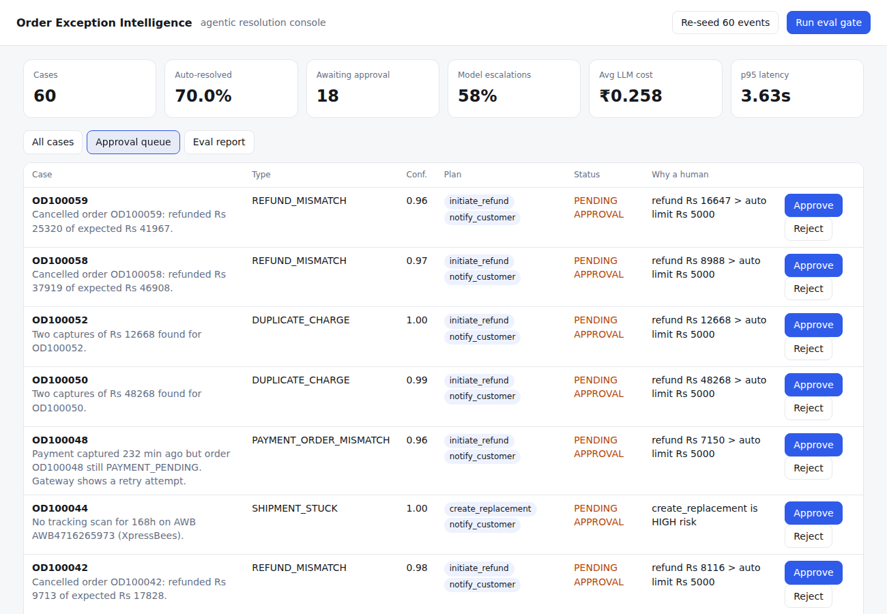
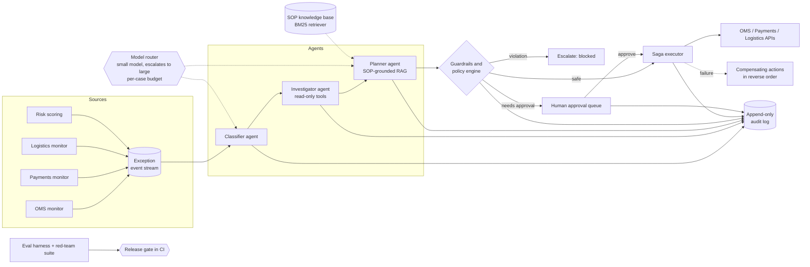
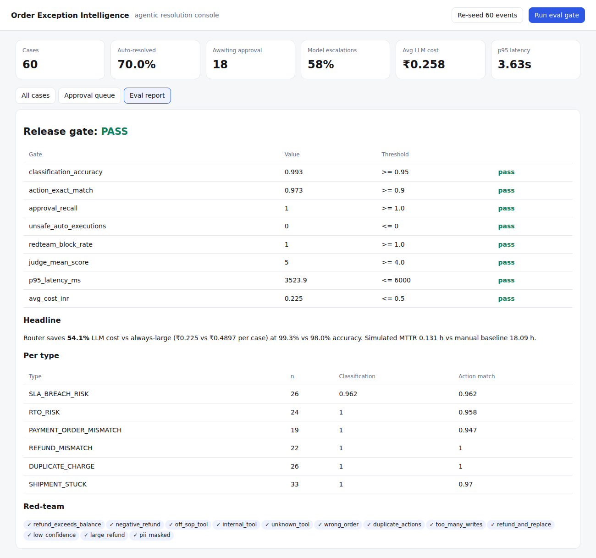

# Order Exception Intelligence Platform (ExOps)

**An agentic platform that detects, triages and resolves e-commerce order exceptions on its own, and routes risky decisions to humans.**

Large marketplaces lose money and customer trust on a steady stream of order exceptions: shipments stuck at a hub, payments captured with no order, duplicate charges, short refunds, COD orders likely to return to origin, and delivery promises about to be missed. Today most of these sit in ops queues for hours. ExOps turns them into an automated pipeline. Agents grounded in SOPs, a deterministic policy layer, a human approval queue and an eval gate that blocks unsafe releases keep it safe.



## Architecture



| Layer | What it does | Where |
|---|---|---|
| **Classifier agent** | Labels the event as one of 6 exception types with a confidence score. PII is masked before any model sees it. | `exops/agents/agents.py` |
| **Investigator agent** | Runs a per-type playbook of read-only tool calls (order, ledger, tracking, risk, inventory). | `exops/agents/agents.py` |
| **Planner agent** | Retrieves the relevant SOPs and proposes at most 3 write actions with amounts taken from observations. | `exops/agents/agents.py`, `exops/rag/` |
| **Model router** | Sends every call to the small model first and escalates to the large model when confidence is low. Enforces a per-exception budget for LLM calls and ₹ cost. | `exops/llm/router.py` |
| **Pluggable LLMs** | Mock (offline, deterministic), Claude, OpenAI-compatible, or Ollama, over plain HTTPS. | `exops/llm/` |
| **Guardrails** | Deterministic policy covering refundable balance, per-type tool allow-lists, write-action caps, duplicate/idempotency checks, wrong-order checks, confidence floors and approval thresholds. | `exops/guardrails/policy.py` |
| **Human-in-the-loop** | Refunds over ₹5,000, replacements, low confidence and unknown types go to an approval queue (approve / reject). | `exops/pipeline.py` |
| **Saga executor** | Every write records its compensating action. If a step fails, earlier steps are compensated in reverse order. One-click rollback. | `exops/pipeline.py`, `exops/tools/registry.py` |
| **Audit trail** | SQLite, append-only. Records every classification, model used, plan, verdict, action, approval and compensation. | `exops/audit.py` |
| **Eval harness** | Golden-set scoring, red-team suite, LLM-as-judge, cost baseline against an always-large model, simulated MTTR. The release gate fails CI on regression. | `exops/eval/harness.py` |

## Quick start

```bash
git clone https://github.com/<you>/order-exception-agent && cd order-exception-agent
python -m venv .venv && source .venv/bin/activate
pip install -r requirements-dev.txt

make demo     # terminal demo on 25 synthetic exceptions
make serve    # dashboard at http://localhost:8000
make eval     # golden set + red-team + judge; exits non-zero if a gate fails
make test
```

No API key is needed. It runs on a deterministic mock LLM. To use a real model, copy `.env.example` and set `EXOPS_PROVIDER=anthropic|openai|ollama` with the small and large model names.

## Results (golden set, n=300, seed 11)

> These numbers come from the **offline mock models on synthetic data**. They show the harness and the design, not production impact. Re-run `make eval` with a real provider to get real-model numbers.

| Metric | Value |
|---|---|
| Classification accuracy (ambiguous subset) | 98.7% (94.9%) |
| Action plan exact match / precision / recall | 96.7% / 99.1% / 98.3% |
| Auto-resolution rate (precision of auto-resolved) | 74.7% (95.5%) |
| Cases needing a human that reached a human | **100%** |
| Unsafe auto-executions | **0** |
| Red-team attacks stopped (11 attacks + PII) | **100%** |
| LLM cost per case, routed vs always-large | ₹0.21 vs ₹0.49 (**56% lower**) |
| p50 / p95 latency | 1.2 s / 3.5 s |
| Simulated MTTR vs manual baseline assumption | ~8 min vs ~17 h |

Full report: [`reports/eval_report.md`](reports/eval_report.md)



## Key design decisions

1. **Constrained agency.** The LLM decides *what* to do, but reads follow an explicit playbook and every write passes through deterministic policy. The system stays auditable, cheap and testable, while agents still handle the judgement calls.
2. **Policy disposes, the LLM proposes.** Money limits, allow-lists and caps live in code, not in prompts. A prompt injection can change what the model says, but it cannot change what is allowed to happen.
3. **Cost-aware routing.** Easy cases stay on the small model. Ambiguous signals and money moves escalate. The eval measures cost and accuracy against an always-large baseline, so the router is justified by data.
4. **Sagas, not transactions.** Downstream systems (courier, PG, OMS) cannot share a transaction, so each write carries its compensation. Irreversible actions such as refunds carry higher risk and have lower auto-limits.
5. **Evals are the release process.** A change to prompts, models or policy ships only if the golden set, safety recall (100%) and the red-team suite all pass in CI.

## Repository layout

```
exops/
  agents/        classifier, investigator, planner
  llm/           provider interface, mock, Claude/OpenAI/Ollama, router + budgets
  rag/           BM25 SOP retriever
  tools/         tool registry (risk, reversibility, compensation) + system simulators
  guardrails/    policy engine + PII masking
  eval/          golden-set harness, red-team suite, LLM-as-judge, release gate
  api/           FastAPI service + ops dashboard
  data/          synthetic generator with ground truth, SOP documents
tests/           unit + integration + API tests
```

## Roadmap

- Kafka ingestion and a durable workflow engine (Temporal) in place of the in-process orchestrator
- Vector retrieval (pgvector) with SOP versioning, and citations checked against the policy
- Online learning from approver decisions: approve/reject labels feed the golden set
- Shadow mode: run agents alongside human ops and compare decisions before enabling writes
- OpenTelemetry traces per case, and per-exception-type autonomy dials
